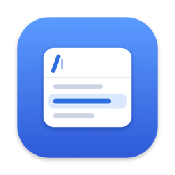
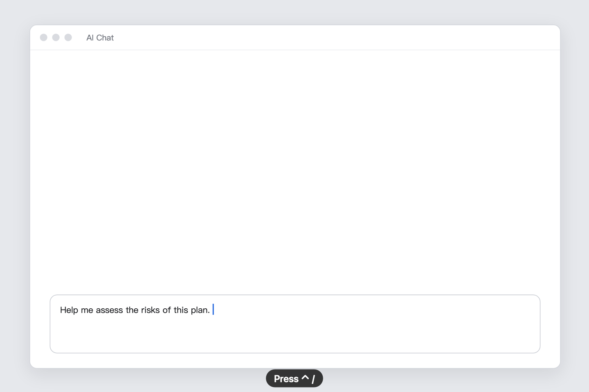
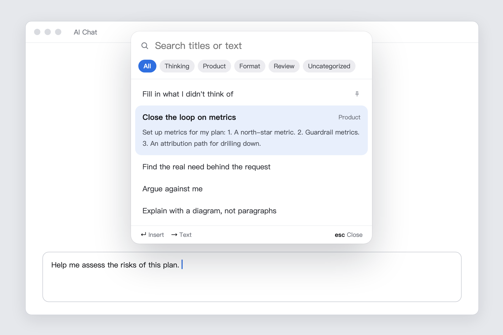
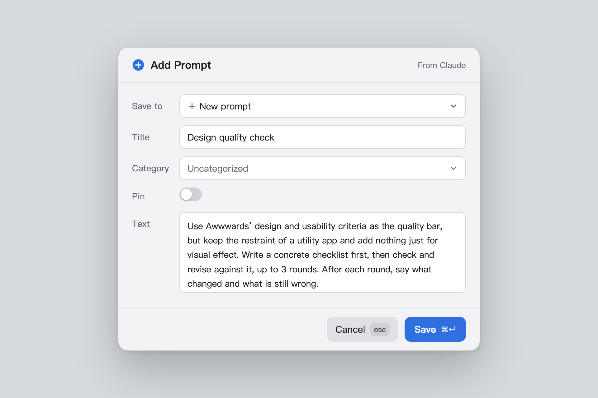
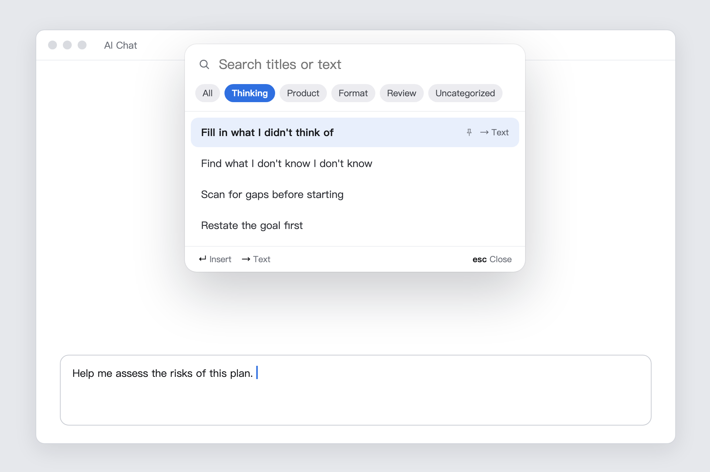
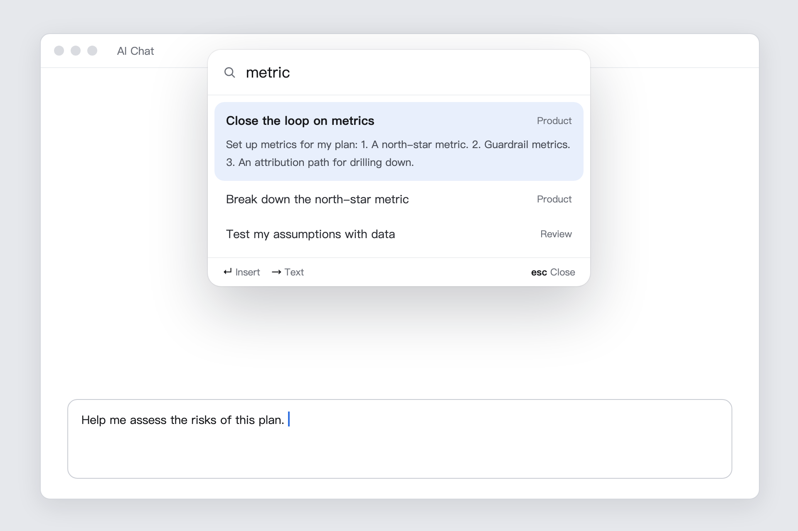
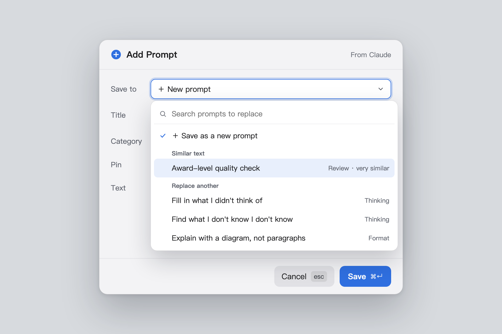
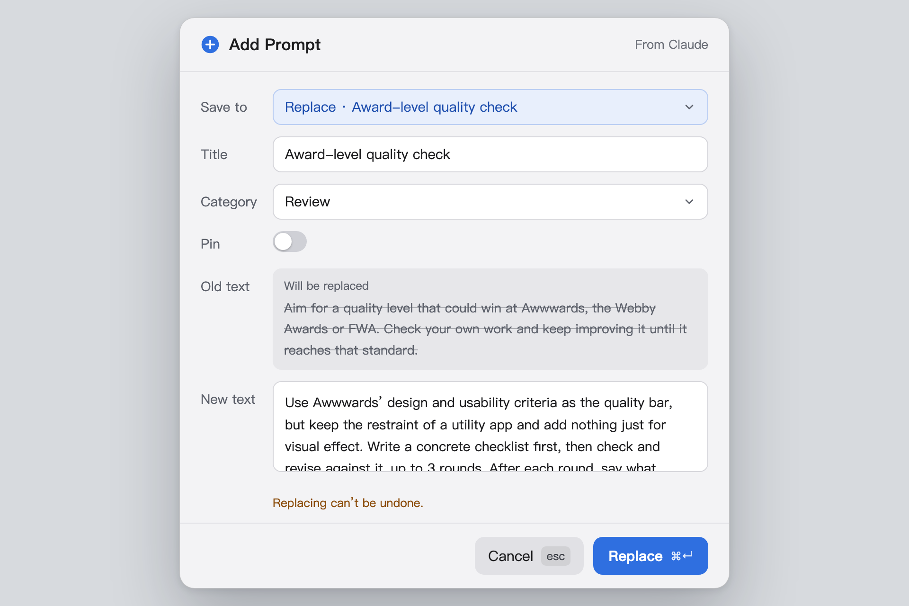
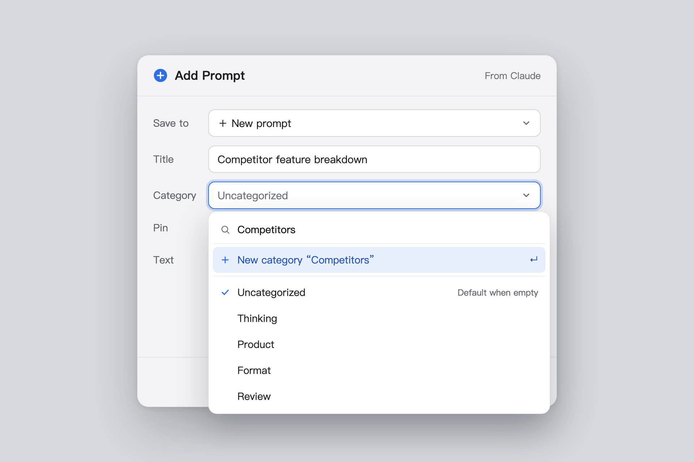
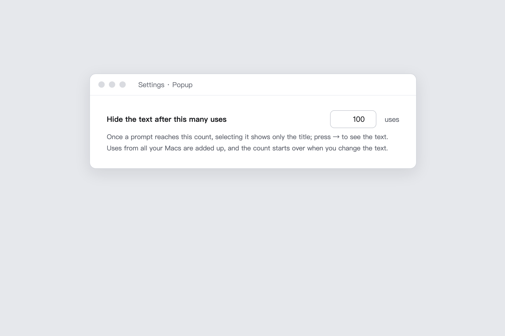

<p align="center"></p>

<h1 align="center">Prompt HUD</h1>

**Your prompt library, one keystroke away, right next to the text cursor.**

Press <kbd>⌃</kbd> <kbd>/</kbd> in any app, pick a prompt, press <kbd>↵</kbd>, and it is inserted where you were typing. No switching windows, no hunting through notes, no copy and paste.

<p align="center"><b>English</b> · <a href="README.zh-CN.md">简体中文</a> · <a href="https://github.com/ienvenue/prompt-hud/releases/latest"><b>Download</b></a></p>

<p align="center">
  <a href="https://github.com/ienvenue/prompt-hud/releases/latest"></a>
  <a href="https://github.com/ienvenue/prompt-hud/releases"></a>
  <a href="https://github.com/ienvenue/prompt-hud/actions/workflows/ci.yml"></a>
  
  <a href="LICENSE"></a>
  <a href="https://linux.do"></a>
</p>

<p align="center">
  
</p>

## Why

If you work with AI tools every day, you keep reusing the same instructions: "list the edge cases I missed", "answer with the conclusion first", "argue against my plan". They end up scattered across notes, documents and chat history, and every use breaks your flow.

Prompt HUD keeps them in one place and brings them to your cursor.

## Features

- **Opens at the text cursor.** The popup appears right where you are typing, in any app (or at the mouse pointer when an app doesn’t report its cursor).
- **Keyboard first.** Type to search titles and text, use the arrow keys, press <kbd>↵</kbd> to insert. Your clipboard is restored afterwards.
- **Capture in one step.** Select text anywhere and press <kbd>⌃</kbd> <kbd>⇧</kbd> <kbd>/</kbd> to save it as a prompt. If it looks like one you already have, Prompt HUD offers to replace it instead.
- **Learns what you know.** New prompts show their text when selected. After you have used a prompt enough times (100 by default), only its title is shown, so the list stays short.
- **Save from a web page.** A `prompthud://add?title=…&category=…&prompt=…` link opens the capture form already filled in. Nothing is saved until you press <kbd>⌘</kbd> <kbd>↵</kbd>.
- **Categories and pins.** Switch categories with <kbd>⇥</kbd>, and pin the prompts you always want on top.
- **Syncs across your Macs** through iCloud Drive. No account, no server.
- **Private.** Prompt HUD never connects to the internet.
- **English and Simplified Chinese** interface.

<table>
  <tr>
    <td></td>
    <td></td>
  </tr>
</table>

<details>
<summary>More screenshots</summary>

| | |
|---|---|
| <br>Familiar prompts show only their title | <br>Search covers every category |
| <br>Similar prompts are suggested when you capture | <br>Replace an existing prompt, with the old text shown |
| <br>Pick a category or create one on the spot | <br>Choose when a prompt’s text gets hidden |

</details>

## Requirements

- macOS 14 Sonoma or later
- Apple silicon or Intel Mac

## Download

1. Download the latest `Prompt-HUD-x.y.z-macOS.zip` from [Releases](https://github.com/ienvenue/prompt-hud/releases/latest) and unzip it.
2. Drag **Prompt HUD.app** into **Applications**.
3. Open it. The app is free and open source but not notarized by Apple, so macOS blocks it the first time ("Apple could not verify…"). Click **Done**, go to **System Settings → Privacy & Security**, scroll down and click **Open Anyway**.
   Or, in Terminal:
   ```bash
   xattr -cr "/Applications/Prompt HUD.app"
   ```
4. Allow **Accessibility** when asked (see below).

The download is built by [GitHub Actions](.github/workflows/release.yml) straight from this repository's source, and each release lists its SHA-256 checksum.

## Build from source

Needs Xcode 26 or later.

```bash
git clone https://github.com/ienvenue/prompt-hud.git
cd prompt-hud
scripts/run.sh
```

`run.sh` runs SwiftLint (if installed), the tests, builds the app and starts it. The app is at `DerivedData/PromptHUD/Build/Products/Debug/PromptHUD.app`. You can also open `PromptHUD.xcodeproj` in Xcode and press Run.

**Accessibility permission.** On first launch, Prompt HUD asks for Accessibility permission (System Settings → Privacy & Security → Accessibility). It needs it to find the text cursor, read the selected text, and paste. Without it, prompts are copied to the clipboard and you paste them yourself.

By default the app is signed to run locally, which needs no Apple account. With this kind of signing, macOS may forget the permission after each rebuild: turn Prompt HUD off and on again in the Accessibility list. To keep the permission across rebuilds, sign with your own certificate. See [CONTRIBUTING.md](CONTRIBUTING.md#code-signing).

## Usage

| Shortcut | Action |
|---|---|
| <kbd>⌃</kbd> <kbd>/</kbd> | Open the popup at the text cursor |
| <kbd>⌃</kbd> <kbd>⇧</kbd> <kbd>/</kbd> | Save the selected text as a prompt |

In the popup:

| Key | Action |
|---|---|
| Type | Search all prompts (titles, categories and text) |
| <kbd>↑</kbd> <kbd>↓</kbd> | Select |
| <kbd>⇥</kbd> / <kbd>⇧</kbd> <kbd>⇥</kbd> | Next / previous category |
| <kbd>↵</kbd> or click | Insert the prompt |
| <kbd>→</kbd> / <kbd>←</kbd> | Show / hide the text of a prompt you already know well (when the cursor is at the end of the search field) |
| <kbd>⌘</kbd> <kbd>E</kbd> | Edit or delete the selected prompt |
| <kbd>esc</kbd> | Clear the search, then close |

In the capture and edit form, <kbd>⌘</kbd> <kbd>↵</kbd> saves and <kbd>esc</kbd> cancels. You can change both global shortcuts and the "familiar" threshold in Settings.

## Your data

- **Prompts** live in **iCloud Drive › Prompt HUD**, one small JSON file per prompt. Every Mac signed in to the same Apple ID with iCloud Drive turned on shares them. Changes usually show up on your other Macs within seconds to a couple of minutes.
- Without iCloud Drive, the same folder is kept in `~/Library/Application Support/PromptHUD/library`. Turn iCloud Drive on later and it moves over automatically.
- **Backups:** before every change, a snapshot of all prompts is saved to `~/Library/Application Support/PromptHUD/backups`. The latest 50 are kept, on each Mac separately.
- **Usage counts** are stored per Mac and added up across your Macs.

Please don't edit the files by hand while the app is running.

## Privacy

Prompt HUD makes no network connections and collects nothing. It keeps a local usage log (`~/Library/Application Support/PromptHUD/usage.log`) for the "Usage in the Last 7 Days" summary in the menu bar. The log records event types, times, how long a search was, and which app you were in. It never records prompt text or what you searched for, and it never leaves your Mac.

## FAQ

**<kbd>⌃</kbd> <kbd>/</kbd> does nothing, or only works sometimes.**
Another app is probably using the same shortcut. Prompt HUD warns you when a shortcut clashes with a system shortcut, but macOS doesn't report clashes with other apps. Pick a different shortcut in Settings.

**It says "Copied — press ⌘V to paste" instead of inserting.**
Accessibility permission is missing. Turn Prompt HUD on in System Settings → Privacy & Security → Accessibility. If it is already on, turn it off and on again.

**After updating, prompts are copied instead of inserted.**
The downloaded app is signed to run locally, so macOS treats each new version as a different app and may forget the Accessibility permission. Turn Prompt HUD off and on again in System Settings → Privacy & Security → Accessibility.

**Nothing is inserted into a password field.**
That's intended. macOS blocks simulated typing in secure fields.

## Contributing

Bug reports are welcome in [Issues](https://github.com/ienvenue/prompt-hud/issues); questions and ideas in [Discussions](https://github.com/ienvenue/prompt-hud/discussions). For code changes, see [CONTRIBUTING.md](CONTRIBUTING.md). To report a security problem privately, see [SECURITY.md](SECURITY.md).

## Community

Discussion and feedback are also welcome on [LINUX DO](https://linux.do).

## License and credits

[MIT](LICENSE). Prompt HUD started as a fork of [Maccy](https://github.com/p0deje/Maccy), the clipboard manager by Alex Rodionov. Its clipboard history has been removed, and Maccy's copyright notice is kept in the license as required.
