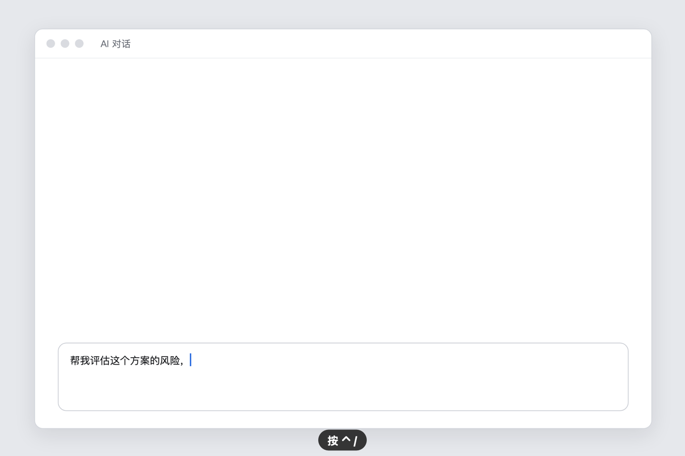
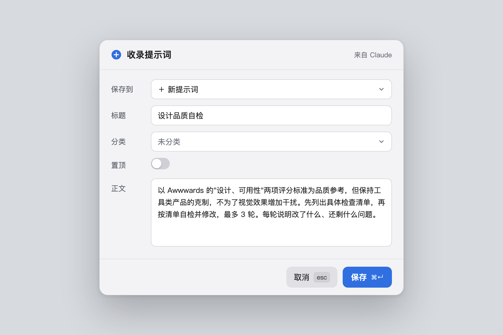
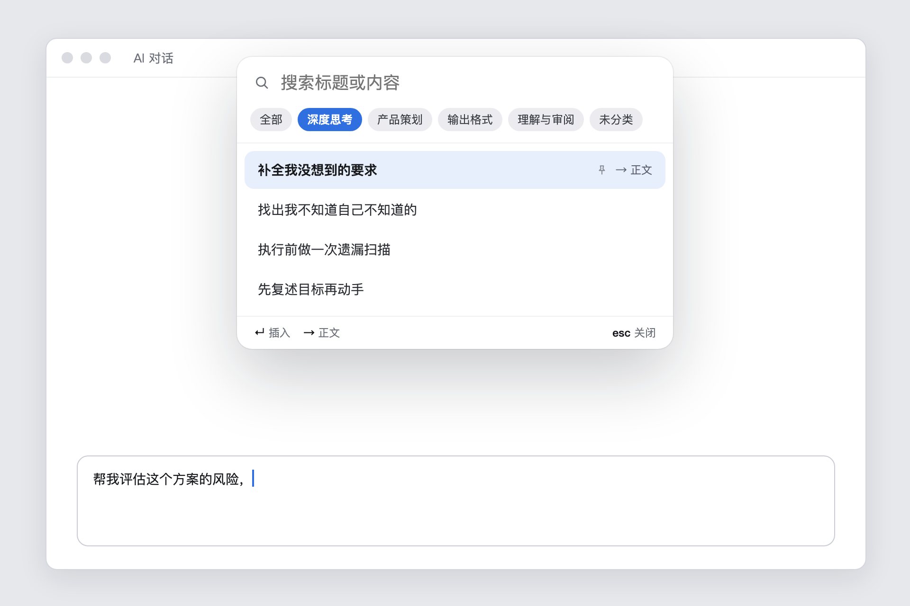
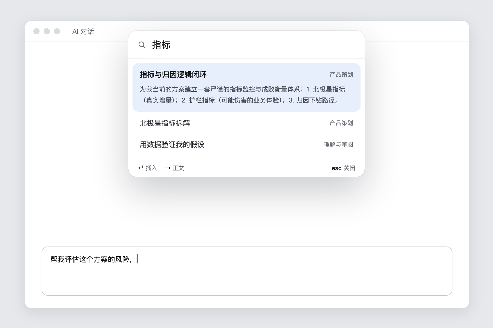
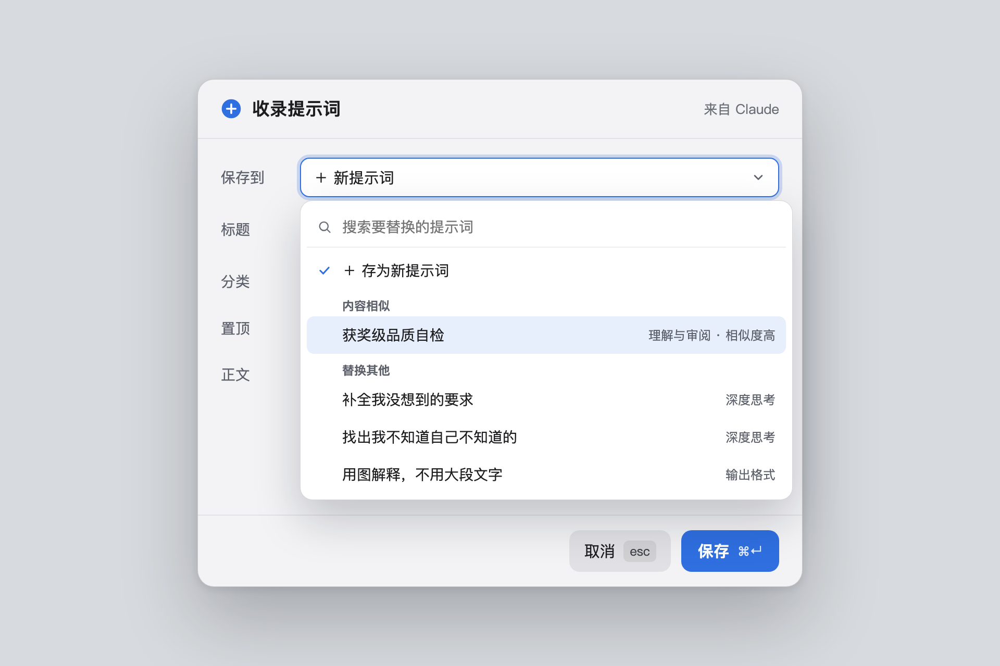
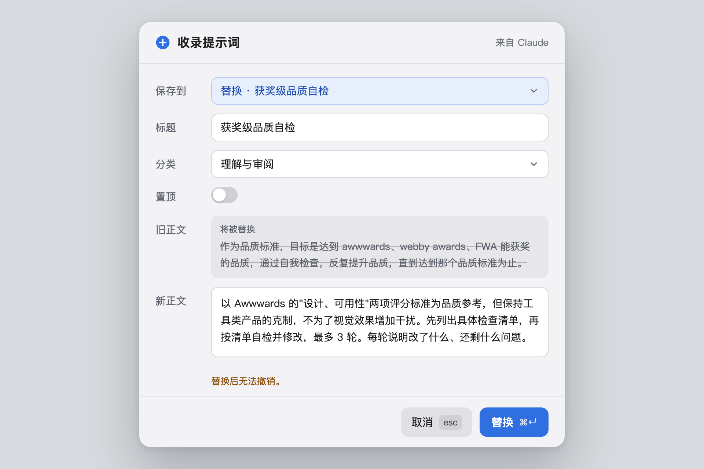
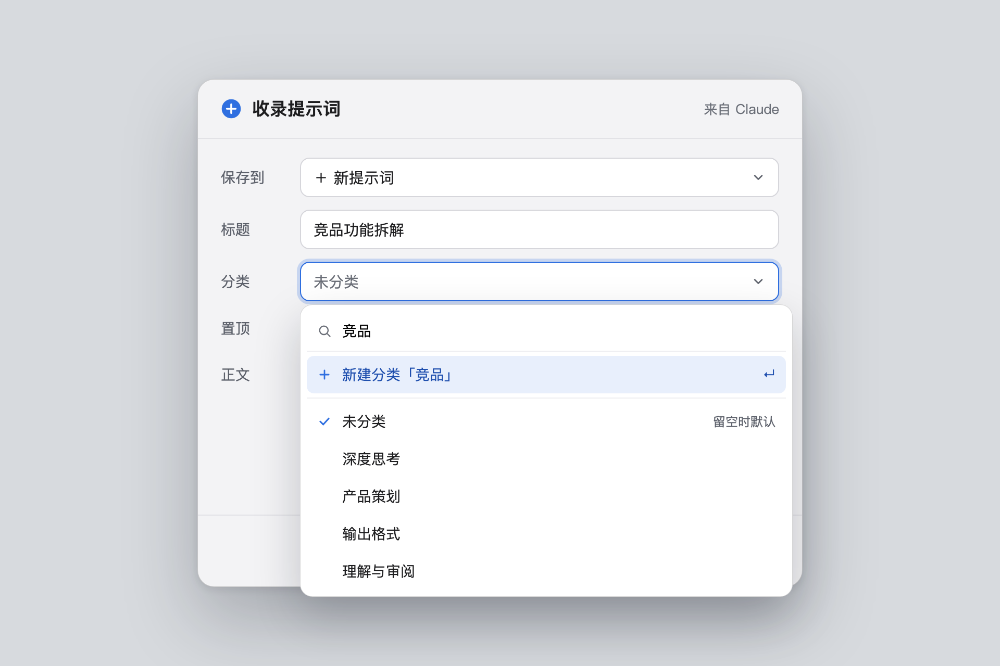
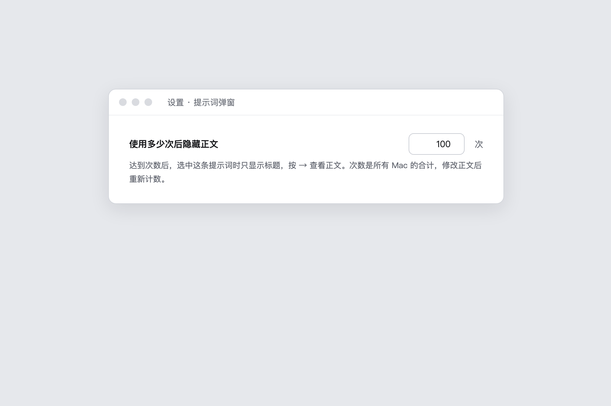

<p align="center"></p>

<h1 align="center">Prompt HUD</h1>

**把常用提示词放在文字光标旁边，一个快捷键就能调出来。**

在任何 App 里按 <kbd>⌃</kbd> <kbd>/</kbd>，选一条提示词，按 <kbd>↵</kbd>，它就会出现在你正在输入的地方。不用切换窗口，不用翻笔记，也不用复制粘贴。

<p align="center"><a href="README.md">English</a> · <b>简体中文</b> · <a href="https://github.com/ienvenue/prompt-hud/releases/latest"><b>下载</b></a></p>

<p align="center">
  <a href="https://github.com/ienvenue/prompt-hud/releases/latest"></a>
  <a href="https://github.com/ienvenue/prompt-hud/releases"></a>
  <a href="https://github.com/ienvenue/prompt-hud/actions/workflows/ci.yml"></a>
  
  <a href="LICENSE"></a>
  <a href="https://linux.do"></a>
</p>

<p align="center">
  
</p>

## 为什么做它

天天用 AI 工具的人，总在重复使用同几段指令：「列出我没想到的边缘情况」「结论先行」「反驳我的方案」。它们散落在笔记、文档和聊天记录里，每次找一遍都会打断思路。

Prompt HUD 把它们收在一处，并且送到你的光标旁边。

## 功能

- **在光标旁弹出**：在任何 App 里，弹窗都出现在你正在输入的位置（App 不提供光标位置时，出现在鼠标旁）。
- **键盘优先**：直接输入就能搜标题和正文，用方向键选，按 <kbd>↵</kbd> 插入。插入后会恢复你原来的剪贴板。
- **一步收录**：选中任意文字，按 <kbd>⌃</kbd> <kbd>⇧</kbd> <kbd>/</kbd> 存为提示词。如果和已有的某条很像，会建议你直接替换。
- **越用越简洁**：新提示词被选中时会展开正文；用满一定次数（默认 100 次）后只显示标题，列表保持清爽。
- **从网页存入**：打开 `prompthud://add?title=…&category=…&prompt=…` 这样的链接，收录表单会自动填好内容。按 <kbd>⌘</kbd> <kbd>↵</kbd> 才会保存。
- **分类和置顶**：<kbd>⇥</kbd> 切换分类，常用的可以置顶。
- **多台 Mac 同步**：通过 iCloud 云盘，不需要注册账号，也没有服务器。
- **注重隐私**：Prompt HUD 从不联网。
- **英文和简体中文**界面。

<table>
  <tr>
    <td></td>
    <td></td>
  </tr>
</table>

<details>
<summary>更多截图</summary>

| | |
|---|---|
| <br>熟练的提示词只显示标题 | <br>搜索时跨所有分类 |
| <br>收录时推荐内容相似的提示词 | <br>替换已有提示词，旧正文一目了然 |
| <br>选择分类，或当场新建 | <br>设置提示词用多少次后隐藏正文 |

</details>

## 系统要求

- macOS 14 Sonoma 及以上
- Apple 芯片和 Intel 芯片的 Mac 都支持

## 下载安装

1. 到 [Releases](https://github.com/ienvenue/prompt-hud/releases/latest) 下载最新的 `Prompt-HUD-x.y.z-macOS.zip`，解压。
2. 把 **Prompt HUD.app** 拖进「应用程序」。
3. 打开它。App 免费开源，但没有经过苹果公证，第一次打开会被系统拦下（提示「Apple 无法验证……」）。点「完成」，再到「系统设置 → 隐私与安全性」，往下翻，点「仍要打开」。
   也可以在终端运行：
   ```bash
   xattr -cr "/Applications/Prompt HUD.app"
   ```
4. 按提示允许「辅助功能」权限（见下文）。

安装包由 [GitHub Actions](.github/workflows/release.yml) 直接用本仓库的源码编译，每个版本都附有 SHA-256 校验值。

## 从源码编译

需要 Xcode 26 及以上。

```bash
git clone https://github.com/ienvenue/prompt-hud.git
cd prompt-hud
scripts/run.sh
```

`run.sh` 会依次运行代码检查（装了 SwiftLint 才会运行）和测试，然后编译并启动 App。编译出的 App 在 `DerivedData/PromptHUD/Build/Products/Debug/PromptHUD.app`。也可以用 Xcode 打开 `PromptHUD.xcodeproj`，点运行。

**辅助功能权限**：第一次打开时，Prompt HUD 会请求辅助功能权限（系统设置 → 隐私与安全性 → 辅助功能）。它要靠这个权限找到文字光标、读取选中的文字、执行粘贴。没有权限时，提示词会复制到剪贴板，需要你自己粘贴。

工程默认使用「本机签名」，不需要 Apple 账号。用这种签名时，每次重新编译后 macOS 可能会忘掉权限，这时在辅助功能列表里把 Prompt HUD 关掉再打开即可。想让权限一直保留，可以用自己的证书签名，见 [CONTRIBUTING.md](CONTRIBUTING.md#code-signing)。

## 使用

| 快捷键 | 作用 |
|---|---|
| <kbd>⌃</kbd> <kbd>/</kbd> | 在光标旁打开弹窗 |
| <kbd>⌃</kbd> <kbd>⇧</kbd> <kbd>/</kbd> | 把选中的文字存为提示词 |

弹窗里：

| 按键 | 作用 |
|---|---|
| 直接输入 | 在全部提示词里搜索（标题、分类、正文） |
| <kbd>↑</kbd> <kbd>↓</kbd> | 选择 |
| <kbd>⇥</kbd> / <kbd>⇧</kbd> <kbd>⇥</kbd> | 下一个 / 上一个分类 |
| <kbd>↵</kbd> 或单击 | 插入 |
| <kbd>→</kbd> / <kbd>←</kbd> | 展开 / 收起已经熟练的提示词的正文（搜索框里的光标在最后时生效） |
| <kbd>⌘</kbd> <kbd>E</kbd> | 编辑或删除选中的提示词 |
| <kbd>esc</kbd> | 先清空搜索，再按一次关闭 |

收录和编辑表单里，<kbd>⌘</kbd> <kbd>↵</kbd> 保存，<kbd>esc</kbd> 取消。两个全局快捷键和「熟练」次数都可以在设置里修改。

## 你的数据

- **提示词**存放在 **iCloud 云盘 › Prompt HUD**，每条一个小的 JSON 文件。登录同一个 Apple ID 并打开 iCloud 云盘的 Mac 会共享这些提示词，一台上的修改通常几秒到一两分钟后出现在另一台上。
- 没有开 iCloud 云盘时，同样的文件夹放在 `~/Library/Application Support/PromptHUD/library`。之后打开 iCloud 云盘，会自动搬过去。
- **备份**：每次修改前，都会把全部提示词存一份快照到 `~/Library/Application Support/PromptHUD/backups`，保留最近 50 份。每台 Mac 各自保留。
- **使用次数**每台 Mac 分开记录，显示时加在一起。

App 运行时请不要手动修改这些文件。

## 隐私

Prompt HUD 不联网，也不收集任何数据。它会在本机记一份使用日志（`~/Library/Application Support/PromptHUD/usage.log`），用于菜单栏里的「最近 7 天使用统计」。日志只记录事件类型、时间、搜索词的长度和你当时所在的 App，从不记录提示词正文和搜索内容，也不会离开你的 Mac。

## 常见问题

**按 <kbd>⌃</kbd> <kbd>/</kbd> 没反应，或者时灵时不灵。**
多半是其他 App 也用了这个快捷键。和系统快捷键冲突时，Prompt HUD 会提醒你；但和其他 App 冲突，macOS 不会告诉它。请在设置里换一个快捷键。

**没有插入，而是提示「已复制，按 ⌘V 粘贴」。**
缺少辅助功能权限。去系统设置 → 隐私与安全性 → 辅助功能里打开 Prompt HUD；如果已经打开了，关掉再打开一次。

**更新后，提示词只被复制、没有插入。**
下载版用的是本机签名，macOS 会把每个新版本当成另一个 App，可能忘记辅助功能权限。到「系统设置 → 隐私与安全性 → 辅助功能」，把 Prompt HUD 关掉再打开。

**密码框里插入不了。**
这是正常的。macOS 不允许在安全输入框里模拟输入。

## 参与贡献

问题反馈请发到 [Issues](https://github.com/ienvenue/prompt-hud/issues)，使用疑问和想法欢迎到 [Discussions](https://github.com/ienvenue/prompt-hud/discussions) 讨论。想修改代码，请看 [CONTRIBUTING.md](CONTRIBUTING.md)。发现安全问题请私下报告，见 [SECURITY.md](SECURITY.md)。

## 社区

也欢迎到 [LINUX DO](https://linux.do) 讨论和反馈。

## 许可证与致谢

[MIT](LICENSE)。Prompt HUD 最初基于 Alex Rodionov 开发的剪贴板工具 [Maccy](https://github.com/p0deje/Maccy) 改造而来，Maccy 的剪贴板历史功能已经移除。按许可证要求，许可证中保留了 Maccy 的版权声明。
